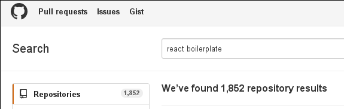

# boilerplate-name-generator

Generates a boilerplate name !

[demo](http://dev.ehret.me/boilerplate-name-generator/)

## why ?

Seriously...

## seriously, why ??

- Because the frontend things are getting over complicated.
- Because there are too many boilerplates already but I can help you add more :smile:
- For the lulz.

## how to use

Copy and paste the generated name and create your boilerplate !

## license

MIT
